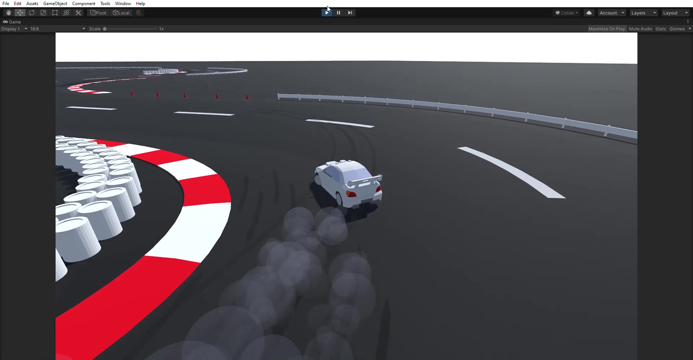

# Slipstream
A polymetric racing game prototype built in the unity game engine. The ultimate goal of the project is to have both handcrafted maps as well as randomly generated tracks and for the player to build cars that fit the given track.

### Dependencies
- Unity

## License
This project is licensed under the MIT License - see the [LICENSE.md](LICENSE.md) file for details
